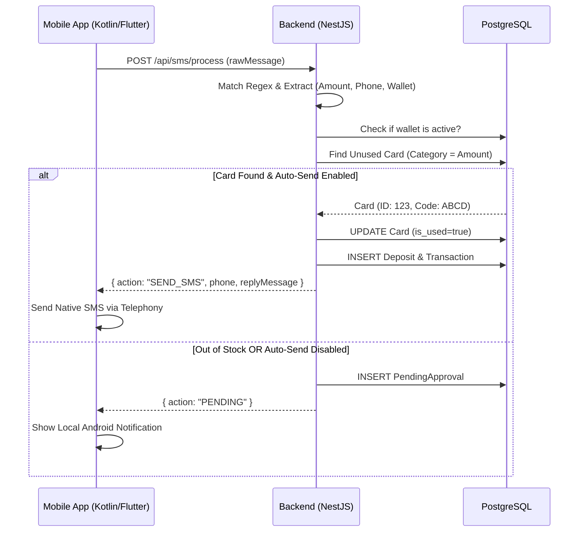
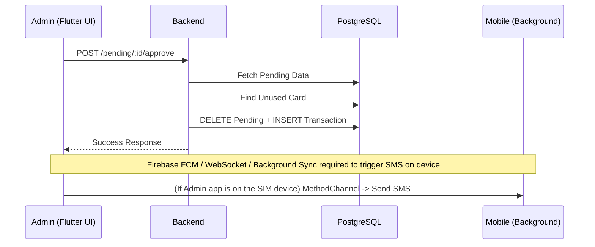

# Master Blueprint - Kurotek System v2.0 🚀
**وثيقة التصميم الهندسي المرجعية النهائية (Single Source of Truth)**

---

## 1. تفصيل الميزات (Features Breakdown)

### 1.1 ميزة تسجيل الدخول (Authentication)
* **الهدف:** توثيق هوية مدير المحل بأمان للوصول للوحة التحكم.
* **كيف تعمل:** يرسل التطبيق Serial و Password. يقارن السيرفر الـ Password المشفرة، وإذا نجح، يصدر `JWT Token`.
* **السيناريوهات:** 
  - *نجاح:* يعود Token صالح لـ 24 ساعة.
  - *فشل (كلمة مرور خاطئة):* يعود خطأ 401 Unauthorized.
  - *فشل (محل موقوف):* يعود خطأ 403 Forbidden.
* **الملفات (Backend):** `auth.controller.ts`, `auth.service.ts`, `jwt.strategy.ts`
* **الملفات (Flutter):** `auth_repository.dart`, `auth_provider.dart`, `login_screen.dart`
* **APIs:** `POST /api/auth/login`
* **الجداول:** `shops`

### 1.2 ميزة استقبال ومعالجة الـ SMS
* **الهدف:** أتمتة قراءة رسائل الإيداع وتوزيع الكروت.
* **كيف تعمل:** يلتقط تطبيق الأندرويد الـ SMS الواردة → يرسلها للسيرفر → السيرفر يحللها (Regex) ويعتمد الكارت، ويرد للهاتف ليقوم بإرسال رسالة نصية.
* **السيناريوهات:**
  - *نجاح تلقائي:* يتم سحب الكرت وإرجاع أمر للموبايل بإرسال SMS للمستلم.
  - *نجاح معلق (Pending):* إذا كان الإرسال التلقائي معطلاً أو نفد المخزون، يُسجل الإيداع كـ Pending.
  - *فشل:* رسالة لا تطابق أي محفظة → يتجاهلها السيرفر.
* **الملفات (Backend):** `sms.controller.ts`, `sms.service.ts`, `regex.utils.ts`
* **الملفات (Flutter):** `SmsReceiver.kt` (Android Native), `sms_sender.dart`
* **APIs:** `POST /api/sms/process`
* **الجداول:** `deposits`, `transactions`, `cards`, `pending_approvals`, `wallet_configs`

### 1.3 ميزة إدارة الكروت (Cards Management)
* **الهدف:** إضافة ومتابعة مخزون كروت الشحن.
* **كيف تعمل:** يمكن للمشرف رفع مجموعة كروت دفعة واحدة (Bulk) من خلال لصق نص يحتوي على الأكواد/حسابات ميكروتك، ليتم تفكيكها وحفظها في قاعدة البيانات.
* **السيناريوهات:**
  - *نجاح (Bulk):* استخراج 100 كرت وحفظهم كـ Available.
  - *خطأ (صيغة خاطئة):* يرفض النظام العملية مع توضيح الخطأ.
* **الملفات:** `cards.controller.ts`, `cards.service.ts` / `cards_screen.dart`
* **APIs:** `POST /api/cards/bulk`, `GET /api/cards/stock`
* **الجداول:** `cards`, `categories`

---

## 2. قاموس قاعدة البيانات (Database Dictionary)

### 2.1 جدول `shops` (المحلات / المشتركين)
| العمود | النوع | القيود | الفهارس | الغرض |
|---|---|---|---|---|
| `id` | UUID | PK | - | المعرف الفريد للمحل. |
| `shop_name` | VARCHAR(100) | NOT NULL | - | اسم المحل التجاري. |
| `serial_key` | VARCHAR(100) | UNIQUE, NOT NULL | BTREE | مفتاح التفعيل الفريد الخاص بالمحل. |
| `password_hash` | VARCHAR(255) | NOT NULL | - | كلمة المرور مشفرة (Bcrypt). |
| `is_active` | BOOLEAN | DEFAULT true | - | حالة اشتراك المحل (فعال/موقوف). |

### 2.2 جدول `cards` (الكروت)
| العمود | النوع | القيود | الفهارس | الغرض |
|---|---|---|---|---|
| `id` | UUID | PK | - | المعرف الفريد. |
| `shop_id` | UUID | FK -> shops.id | BTREE | ربط الكرت بالمحل المالك. |
| `category_value` | INT | NOT NULL | BTREE | فئة الكرت (100, 200...) لتسريع البحث المباشر. |
| `code` | TEXT | NOT NULL | - | رقم الكرت / الكود الفعلي. |
| `username` | VARCHAR(255) | NULL | - | (اختياري) لشبكات المايكروتك. |
| `password` | VARCHAR(255) | NULL | - | (اختياري) لشبكات المايكروتك. |
| `is_used` | BOOLEAN | DEFAULT false | BTREE | لتصفية الكروت المتاحة بسرعة. |

### 2.3 جدول `deposits` (الإيداعات)
| العمود | النوع | القيود | الفهارس | الغرض |
|---|---|---|---|---|
| `id` | UUID | PK | - | المعرف. |
| `shop_id` | UUID | FK | BTREE | ربط الإيداع بالمحل. |
| `sender_phone` | VARCHAR(50) | NOT NULL | - | رقم مرسل الإيداع أو حساب العميل. |
| `amount` | INT | NOT NULL | - | قيمة الإيداع المالي. |
| `wallet_type` | VARCHAR(30) | NOT NULL | BTREE | المحفظة التي تم عبرها الدفع (جيب، جوالي..). |
| `is_shared` | BOOLEAN | DEFAULT false | - | هل تم إرسال رسالة SMS ناجحة لهذا الإيداع؟ |
| `raw_sms` | TEXT | NULL | - | نص الرسالة الأصلية للاحتياط. |

### 2.4 جدول `wallet_configs` (إعدادات المحافظ الديناميكية)
| العمود | النوع | القيود | الفهارس | الغرض |
|---|---|---|---|---|
| `id` | UUID | PK | - | - |
| `shop_id` | UUID | FK | BTREE | - |
| `wallet_name` | VARCHAR(30) | NOT NULL | - | اسم المحفظة (مثال: "جوالي"). |
| `regex_pattern` | TEXT | NOT NULL | - | التعبير النمطي لاستخراج البيانات. |
| `is_enabled` | BOOLEAN | DEFAULT true | - | هل المحفظة مفعلة حالياً؟ |

---

## 3. عقد الـ APIs (API Contract)

### 3.1 معالجة SMS `POST /api/sms/process`
**الوصف:** يستقبل نص الرسالة القادمة من الموبايل ويتخذ قرار التوزيع.
**Request:**
```json
{
  "rawMessage": "استلمت مبلغ 500 YER من 777777777 رصيدك هو 5300",
  "receivedAt": "2026-06-29T10:00:00Z"
}
```
**Response (Success - Auto Send):**
```json
{
  "success": true,
  "data": {
    "action": "SEND_SMS",
    "targetPhone": "777777777",
    "replyMessage": "تم استلام دفعتك بـ 500 يال. كودك هو: 12345",
    "depositId": "uuid-123"
  }
}
```
**Response (Pending):**
```json
{
  "success": true,
  "data": {
    "action": "PENDING",
    "pendingId": "uuid-pending-456",
    "message": "لا يوجد مخزون كافي وتم وضع الطلب كمعلق."
  }
}
```

### 3.2 الموافقة اليدوية `POST /api/pending/:id/approve`
**الوصف:** يوافق الإدمن على الطلب المعلق ويصرف الكرت.
**Response:**
```json
{
  "success": true,
  "data": {
    "action": "SEND_SMS",
    "targetPhone": "777777777",
    "replyMessage": "تم استلام دفعتك. كودك: 98765"
  }
}
```

---

## 4. خرائط سير العمل (Workflows & Diagrams)

### 4.1 التدفق العام لاستلام رسالة SMS (Auto-Mode)


### 4.2 تدفق الموافقة اليدوية

*ملاحظة حرجة في التصميم:* إذا كان المسؤول يستخدم التطبيق من جهاز، والهاتف الذي يحتوي على الـ SIM موجود في مكان آخر، فكيف سيتم إرسال الـ SMS بعد الموافقة؟ 
**القرار المعماري:** يجب أن يعتمد الهاتف المحتوي على الشريحة على (Polling) كل 10 ثواني، أو (WebSocket / FCM) لاستقبال أوامر إرسال الـ SMS من السيرفر بشكل لحظي. سيتم استخدام WebSocket (Socket.io) لبث أوامر الإرسال للهاتف المتصل.

---

## 5. مخطط واجهات Flutter (Flutter UI Blueprint)

### 5.1 الشاشات الرئيسية (Navigation)
يتم استخدام `BottomNavigationBar` بخمسة تبويبات:
1. **الرئيسية (Home):**
   - *المكونات:* كروت ملخصة للإحصائيات (مبيعات اليوم، المخزون المتبقي). قائمة بآخر 10 حركات مالية تمت.
2. **العمليات (Transactions & Deposits):**
   - *المكونات:* `TabBar` للتبديل بين (الإيداعات | سجل الشحن). فلترة بالتاريخ واسم المحفظة.
3. **المعلقات (Pending):**
   - *المكونات:* قائمة بالطلبات المعلقة. أزرار (موافقة ✅، رفض ❌) في كل كارت طلب.
4. **الكروت (Cards Inventory):**
   - *المكونات:* قائمة الفئات (100، 200..). زر (+) عائم لإضافة كروت Bulk أو Single. زر مبيعات يدوية.
5. **الإعدادات (Settings):**
   - *المكونات:* تفعيل/إيقاف المحافظ. تعديل قوالب الردود. تفعيل/إيقاف النظام بالكامل.

### 5.2 تصميم حالة الشاشات (State Management UX)
- **Loading:** استخدام `Shimmer` Effect بدلاً من `CircularProgressIndicator` التقليدي ليعطي إحساساً بالفخامة والسرعة.
- **Empty:** رسوميات (Lottie/SVG) لافتة (مثال: صندوق فارغ) مع نص واضح "لا توجد كروت هنا".
- **Error:** بطاقة حمراء خفيفة مع زر "إعادة المحاولة" لمعالجة مشاكل الشبكة.

---

## 6. منطق الواجهة الخلفية (Backend Logic Blueprint)

### 6.1 `SmsService` (الخدمة الأهم)
**Business Rules (قواعد العمل):**
1. تنظيف النص من المسافات الزائدة والفواصل.
2. المرور على جميع أنماط المحافظ (Regex) المأخوذة من `wallet_configs` في الداتا بيز بالترتيب.
3. إذا وجد تطابقاً، يتم استخراج (المبلغ، المعرّف).
4. التحقق من جدول `customer_mappings` لمعرفة ما إذا كان المعرف اسماً وليس رقماً لمعرفة الرقم الفعلي.
5. إذا كان `settings.auto_send_sms == false` → حفظ كـ Pending فوراً.
6. إذا كان true → استدعاء `CardsService.getUnusedCard(amount)`.
7. في حال الإرسال الناجح → إرجاع Response به الـ `replyMessage` وتجهيز حدث ليُلتقط في الهاتف لإرسال الـ SMS الحقيقي.

### 6.2 `CardsService`
**Business Rules (قواعد العمل):**
- تفكيك الكروت الدفعية (Bulk): السطر الواحد يعتبر كرتاً. إذا كان السطر يحوي فاصلة أو مسافة معينة قد يتم اعتباره (يوزر / باسورد) حسب إعداد `card_format_mode`.
- عند استخدام كرت، يجب وضع Lock على قاعدة البيانات أو استخدام Transaction (Prisma `$transaction`) لتفادي مشكلة الـ (Race Condition) بحيث لا يصرف السيرفر نفس الكرت لطلبين وصلا في نفس الميلي ثانية.

---

## 7. خطة تنفيذ المهام الدقيقة (Micro Tasks Implementation Plan)

### Phase 1: Backend Infrastructure (الأساسيات والداتا بيز)
1. **Task 1.1:** Initialize NestJS project & Install Prisma, Postgres config, Class-validator.
2. **Task 1.2:** Write `schema.prisma` with all tables, constraints, and indexes. Generate Migration.
3. **Task 1.3:** Implement Global Exception Filter & Format Response Interceptor.
4. **Task 1.4:** Setup AuthModule (JWT config, Hash utilities, Login API).

### Phase 2: Core Data Modules
5. **Task 2.1:** Shops & Settings Module (Automatic settings creation on shop init).
6. **Task 2.2:** Cards Module (Add Bulk, Add Single, Fetch with Pagination).
7. **Task 2.3:** Transactions & Deposits Modules (CRUD).
8. **Task 2.4:** Wallet Config Module (CRUD for Regex patterns).

### Phase 3: The Brain (SMS Parsing Engine)
9. **Task 3.1:** Sms Module: Implement parsing logic (Looping through active wallets regex).
10. **Task 3.2:** Business logic for Auto-Distribution (Transactions, Fetch Card, Mark Used).
11. **Task 3.3:** Pending Approvals Module (Create Pending, Approve, Reject flows).
12. **Task 3.4:** Setup WebSockets (Socket.io) module to emit `send_sms` events to connected mobile devices.

### Phase 4: Flutter App Infrastructure
13. **Task 4.1:** Initialize Flutter (Riverpod, Dio, GoRouter, Freezed).
14. **Task 4.2:** Setup Networking (Dio Client, Auth Interceptor, Error handling mapper).
15. **Task 4.3:** Setup Theming (Colors, Typography, Light/Dark M3).
16. **Task 4.4:** Auth Feature (Login Screen, Store JWT, Router Guard).

### Phase 5: Flutter UI & State (Dashboard)
17. **Task 5.1:** Home Feature (Fetch stats, UI implementation).
18. **Task 5.2:** Cards Feature (Riverpod state, Add Bulk UI, Inventory Table).
19. **Task 5.3:** Pending Feature (List, Approve/Reject interactions).
20. **Task 5.4:** Transactions & Deposits history screens.
21. **Task 5.5:** Settings Screen (Toggles, Template edits).

### Phase 6: Android Native SMS Bridge
22. **Task 6.1:** Write Kotlin `BroadcastReceiver` to intercept SMS in background.
23. **Task 6.2:** Create HTTP request in Kotlin to POST to `/api/sms/process` when SMS is received.
24. **Task 6.3:** Integrate Socket.io client in Flutter (or Native) to listen for `emit("send_sms")` from backend to send physical SMS via `SmsManager`.
25. **Task 6.4:** Implement Notification handling for Pending approvals on the Android device.

---

## 8. معايير الكود (Coding Standards)

1. **لا لاستخدام `any` (No Any Rule):** جميع المتغيرات في TypeScript وفي Dart يجب أن تكون Strongly Typed.
2. **DTOs Everywhere:** أي بيانات تدخل للـ Backend يجب التحقق منها عبر Data Transfer Objects و Decorators الخاصة بـ `class-validator`.
3. **Fail Fast & Explicit Errors:** بدلاً من إرجاع `null` في الأخطاء العميقة، ارمِ Custom Exception ليقوم الـ Global Filter بالتقاطه وتوحيده.
4. **Database Transactions:** أي عملية تقوم بتعديل جدولين معاً (مثال: تعديل الكرت كمستخدم + إنشاء Transaction) يجب أن توضع داخل `$transaction` لحماية البيانات.
5. **Clean Architecture in Flutter:** لا يُسمح بتاتاً بكتابة Business Logic أو استدعاء Dio داخل الـ Widgets (UI). تدفق البيانات حصراً: `Widget -> Provider -> UseCase -> Repository -> DataSource`.
6. **Commit Messages:** يجب استخدام Conventional Commits (مثال: `feat(sms): add socket support for sending`).

---

*(نهاية الـ Master Blueprint - يُمنع كتابة أو تغيير أي كود يمس بنية المشروع دون مراجعة هذه الوثيقة).*
