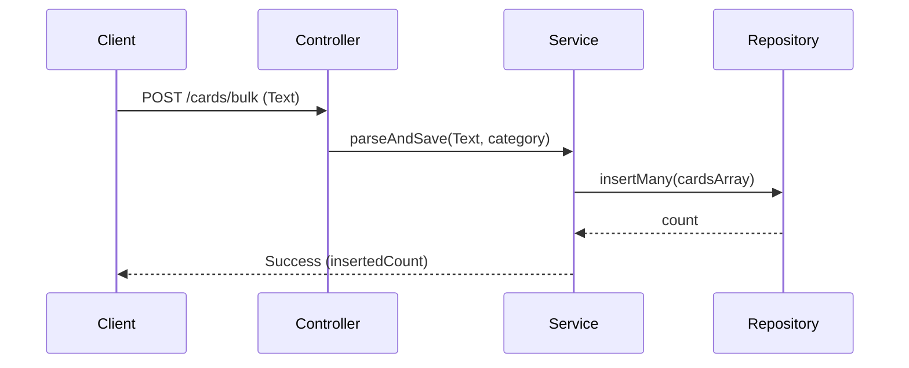
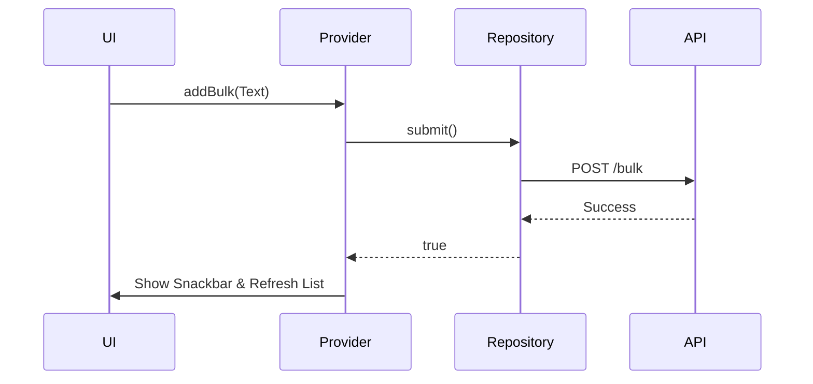

# Technical Specifications (Core Features)

## 1. مقدمة (Introduction)
تُفصل هذه الوثيقة المواصفات التقنية الدقيقة (Technical Specs) للميزات الأساسية (Core Features) في نظام Kurotek لكل من الواجهة الخلفية (Backend) وتطبيق الموبايل (Flutter). 

---

## 2. ميزة إدارة الكروت (Cards Module / Feature)

### 2.1 Backend: `CardsModule`
1. **الهدف:** إدارة مخزون الكروت الرقمية، استيرادها وصرفها.
2. **المسؤوليات:** إدخال كروت جديدة بالجملة، صرف كرت للمستلم، استخراج إحصائيات المخزون.
3. **الملفات:** `cards.module.ts`, `cards.controller.ts`, `cards.service.ts`, `cards.repository.ts`.
4. **Classes:** `CardsService`, `CardsRepository`.
5. **Interfaces:** `ICardPayload`, `ICardResponse`.
6. **DTOs:** `CreateCardsBulkDto`, `CardFilterDto`.
7. **Entities:** `Card` (Prisma Model).
8. **Repository Pattern:** يتولى `CardsRepository` الاتصال المباشر مع Prisma لتنفيذ استعلامات (Insert Many, Update Status).
9. **Service Logic:** تفكيك كود الـ Bulk Text بناءً على `\n` أو فواصل معينة، ثم بناء مصفوفة من الكائنات وحفظها.
10. **Validation Rules:** لا يُسمح برفع نص فارغ. الفئة (categoryValue) يجب أن تكون رقماً موجباً وموجوداً ضمن `categories`.
11. **Business Rules:** الكرت المُباع (is_used=true) لا يمكن إرجاعه لحالة متاح.
12. **API Endpoints:** `POST /api/cards/bulk`, `GET /api/cards/stock`, `DELETE /api/cards/:id`.
13. **Database Tables:** `cards`, `categories`.
14. **Sequence Diagram:**

15. **Flow Diagram:** استقبال النص -> التحقق من الصحة -> التفكيك السطر تلو الآخر -> بناء Array -> إدراج بالداتابيز.
16. **حالات الخطأ:** 
    - `INVALID_FORMAT`: إذا كان النص لا يحتوي على بيانات صالحة. الحل: إعادة 400 Bad Request.
    - `DUPLICATE_CODE`: تجاهل الكروت المكررة باستخدام `skipDuplicates: true` في Prisma.
17. **Unit Tests:** اختبار دالة التفكيك `parseBulkText()` مع نصوص عشوائية.
18. **Integration Tests:** رفع 100 كرت والتحقق من أن استعلام `GET /cards/stock` يعكس العدد الصحيح.
19. **Acceptance Criteria:** يجب أن يستطيع المشرف رفع 1000 كرت دفعة واحدة في أقل من ثانيتين.
20. **Definition of Done:** اجتياز الـ Tests، توثيق Swagger، والـ Endpoint تعمل.

### 2.2 Flutter: `CardsFeature`
1. **الهدف:** واجهة مستخدم لعرض المخزون ورفع كروت جديدة.
2. **المسؤوليات:** جلب قائمة الكروت، فلترتها، وعرض شاشة لإضافة كروت بالنص.
3. **الملفات:** `cards_screen.dart`, `cards_provider.dart`, `cards_repository.dart`, `add_bulk_panel.dart`.
4. **Classes:** `CardsNotifier`, `CardsRemoteDataSource`.
5. **Interfaces:** `ICardsRepository`.
6. **DTOs:** `CardModel` (FromJson/ToJson).
7. **Entities:** `CardEntity` (Domain Layer).
8. **Repository Pattern:** يقوم بعملية Mapping بين `CardModel` القادم من Dio إلى `CardEntity` المستخدم في الـ UI.
9. **Service Logic:** استدعاء APIs وعكس النتيجة على الـ State (Loading, Data, Error).
10. **Validation Rules:** زر الإضافة معطل إذا كان حقل النص فارغاً.
11. **Business Rules:** تحديث حالة الـ UI فوراً بمجرد الرد الناجح دون إعادة تحميل الصفحة (Optimistic Update).
12. **API Endpoints:** نفس الـ Endpoints في الـ Backend.
13. **Database Tables:** N/A (تخزين محلي مؤقت).
14. **Sequence Diagram:** 

15. **Flow Diagram:** ضغط زر إضافة -> عرض Dialog -> إدخال نص -> ضغط حفظ -> إرسال للـ API -> إغلاق Dialog وإظهار نجاح.
16. **حالات الخطأ:** `NetworkError` (إظهار SnackBar).
17. **Unit Tests:** اختبار `CardsNotifier` والتأكد من تغيير الـ State.
18. **Integration Tests:** اختبار واجهة الإضافة (PumpWidget) ومحاكاة النقر.
19. **Acceptance Criteria:** يجب عرض الكروت في جدول متجاوب (DataTable).
20. **Definition of Done:** خلو الكود من الـ Lint warnings وعمل الواجهة بشكل سليم على شاشات الهواتف.

---

*(يتم تكرار نفس المواصفات الدقيقة لجميع الميزات الأخرى Auth, Deposits, Settings ضمن ملفات التوثيق الفردية المخصصة)*
