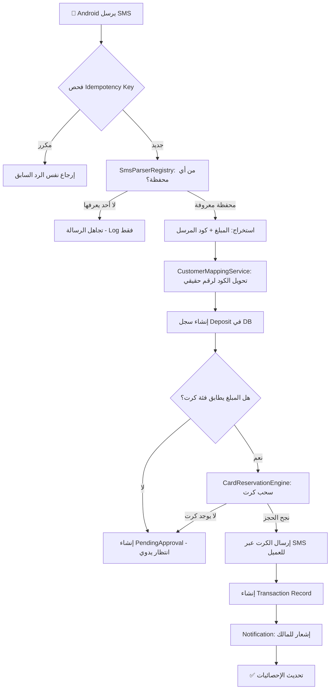
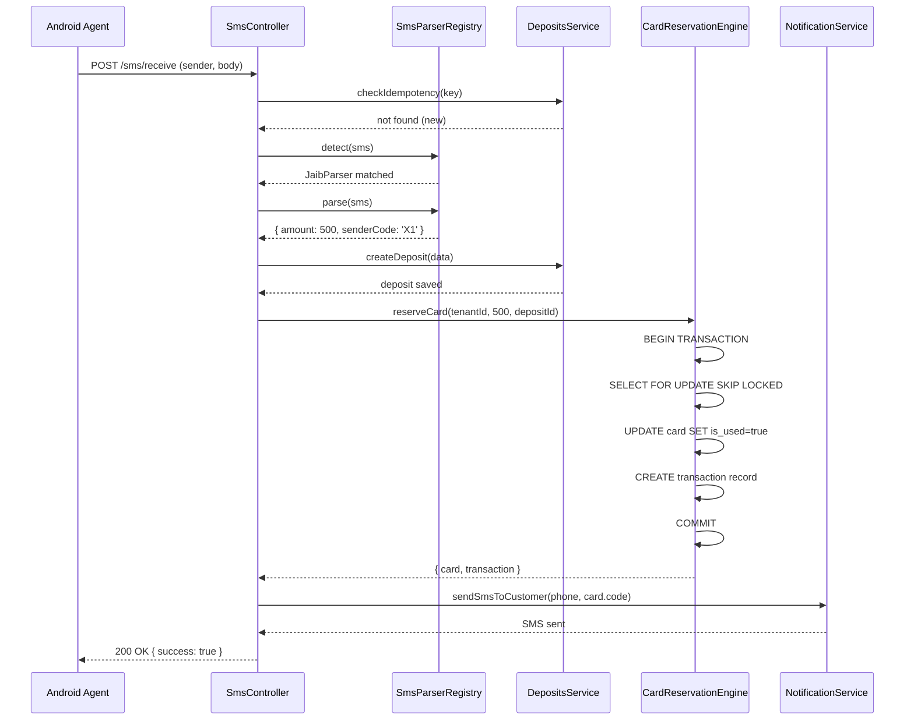
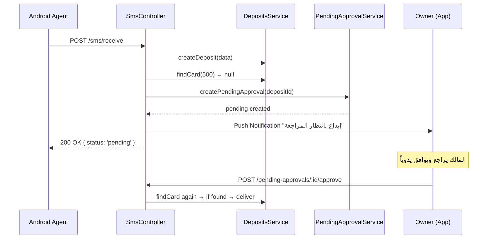
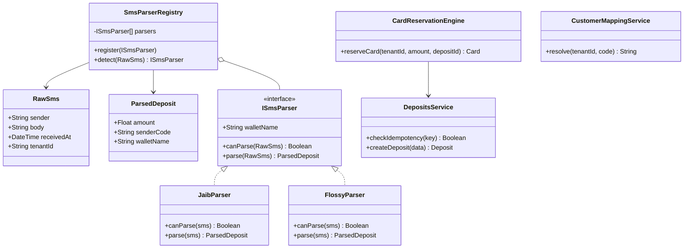

# PHASE_3_ENGINE_DESIGN.md
# SMS & Cards Distribution Engine - Full Architecture Design
**Version:** 1.0 | **Date:** 2026-06-30 | **Status:** Awaiting Approval

---

## 1. SMS Engine Architecture (معمارية محرك الرسائل)

### 1.1 كيفية استقبال الرسائل من Android Agent
يعمل تطبيق الأندرويد كـ **SMS Agent** يستمع لرسائل الـ SMS القادمة عبر `BroadcastReceiver`، ثم يرسلها فوراً عبر HTTP POST إلى الـ Backend.

```
[Android Phone]
  └── BroadcastReceiver (SMS_RECEIVED)
        └── HTTP POST → /sms/receive
              Headers: { Authorization: Bearer <JWT>, X-Idempotency-Key: <hash> }
              Body: { sender, body, receivedAt }
```

**اختيار هندسي:** الأندرويد لا يحلل أي شيء — يرسل الرسالة الخام فقط. كل منطق التحليل يكون في الـ Backend لأن تحديث أنماط الـ Regex يصبح فورياً دون تحديث التطبيق.

### 1.2 منع تكرار الرسائل (Idempotency)
```
X-Idempotency-Key = SHA256(tenantId + sender + body + receivedAt)
```
- يخزن الـ Backend هذا الـ hash في جدول `deposits` (حقل `idempotencyKey`).
- عند وصول طلب، يتم البحث عنه أولاً.
- إذا وُجد → يُرجع الرد المحفوظ فوراً دون أي معالجة.
- إذا لم يوجد → يبدأ الـ Pipeline.

### 1.3 Error Handling & Retry Strategy
| السيناريو | الاستجابة |
|---|---|
| رسالة غير معروفة (لا تطابق Regex) | تُهمل تماماً، لا تُحفظ |
| محفظة معروفة لكن مبلغ غير مدعوم | تُحفظ كـ `PendingApproval` |
| لا يوجد كرت متاح | تُحفظ كـ `PendingApproval` |
| خطأ في قاعدة البيانات | يُعاد المحاولة 3 مرات (500ms, 1s, 2s) |
| فشل نهائي | يُحفظ في سجل الأخطاء ويُرسل إشعار |

---

## 2. SMS Parser Engine (محرك التحليل)

### 2.1 المبدأ التصميمي: Strategy Pattern + Registry
بدلاً من `if/else` طويل، يتم تسجيل كل محفظة كـ **Parser مستقل** في **Registry مركزي**. المحرك يمر على جميع الـ Parsers ويسأل كل واحد: "هل تعرف هذه الرسالة؟".

### 2.2 هيكل الـ Parsers

```typescript
// Interface أساسي لكل محفظة
interface ISmsParser {
  walletName: string;
  canParse(sms: RawSms): boolean;      // هل تنتمي هذه الرسالة لهذه المحفظة؟
  parse(sms: RawSms): ParsedDeposit;   // استخراج البيانات
}

// مثال: محفظة جيب
class JaibParser implements ISmsParser {
  walletName = 'Jaib';
  private pattern = /تم استلام مبلغ (\d+) ريال من (\S+)/;

  canParse(sms: RawSms): boolean {
    return sms.sender === 'Jaib' || this.pattern.test(sms.body);
  }
  parse(sms: RawSms): ParsedDeposit {
    const match = sms.body.match(this.pattern);
    return { amount: parseInt(match[1]), senderCode: match[2] };
  }
}

// Registry المركزي
class SmsParserRegistry {
  private parsers: ISmsParser[] = [];

  register(parser: ISmsParser) { this.parsers.push(parser); }

  detect(sms: RawSms): { parser: ISmsParser } | null {
    for (const parser of this.parsers) {
      if (parser.canParse(sms)) return { parser };
    }
    return null; // رسالة مجهولة
  }
}
```

### 2.3 قراءة الـ Regex من قاعدة البيانات
جدول `wallet_configs` يحتوي على أنماط الـ Regex لكل Tenant، مما يتيح:
- تخصيص أنماط مختلفة لعملاء مختلفين.
- تحديث النمط من لوحة الإعدادات دون إعادة تشغيل الـ Server.

---

## 3. Deposit Processing Pipeline (مسار معالجة الإيداع)

### 3.1 تسلسل الخطوات الكامل



### 3.2 وصف كل خطوة

| الخطوة | الخدمة المسؤولة | الجدول المتأثر |
|---|---|---|
| Receive & Validate | `SmsController` | - |
| Idempotency Check | `DepositsService` | `deposits.idempotency_key` |
| Detect Wallet | `SmsParserRegistry` | `wallet_configs` |
| Extract Data | `ISmsParser.parse()` | - |
| Map Customer | `CustomerMappingService` | `customer_mappings` |
| Create Deposit | `DepositsService` | `deposits` |
| Find Card | `CardsService` | `cards` |
| Reserve & Deliver | `CardReservationEngine` | `cards`, `transactions` |
| Notify | `NotificationService` | - |

---

## 4. Cards Reservation Engine (محرك حجز الكروت)

### 4.1 المشكلة: Race Conditions
إذا وصل طلبان في نفس اللحظة لمبلغ 500 ريال، وكان هناك كرت واحد فقط بقيمة 500، فالخطر هو أن يرى الطلبان الكرت متاحاً ثم يصرفاه مرتين.

### 4.2 الحل: SELECT FOR UPDATE + Prisma Transaction

```typescript
// يجب أن تتم هذه العملية بالكامل أو لا تتم
async reserveCard(tenantId: string, amount: number, depositId: string) {
  return await this.prisma.$transaction(async (tx) => {

    // 1. قفل الصف (Row-Level Lock) - يمنع أي Transaction أخرى من القراءة
    const card = await tx.$queryRaw`
      SELECT * FROM cards
      WHERE tenant_id = ${tenantId}
        AND category_value = ${amount}
        AND is_used = false
      LIMIT 1
      FOR UPDATE SKIP LOCKED
    `;

    if (!card[0]) return null; // لا يوجد كرت متاح

    // 2. تحديث الكرت كمستخدم (Atomic)
    await tx.card.update({
      where: { id: card[0].id },
      data: { isUsed: true, usedAt: new Date() }
    });

    // 3. إنشاء سجل المعاملة في نفس الـ Transaction
    const transaction = await tx.transaction.create({
      data: { tenantId, depositId, amount, cardId: card[0].id }
    });

    return { card: card[0], transaction };
  });
}
```

**لماذا `SKIP LOCKED`؟** إذا كان كرت ما مقفولاً من معاملة أخرى، نتخطاه ونأخذ الكرت التالي المتاح، بدلاً من الانتظار.

### 4.3 ضمانات المحرك
- ✅ **Atomicity:** إما أن يُصرف الكرت ويُسجل التحويل معاً، أو لا يحدث شيء.
- ✅ **No Duplicate:** المقفل `FOR UPDATE` يضمن أن طلبين لا يمكنهما أخذ نفس الكرت.
- ✅ **No Deadlock:** `SKIP LOCKED` يمنع انتظار الـ Transactions لبعضها.

---

## 5. Queue Design: هل نحتاج BullMQ/Redis؟

### 5.1 تحليل الحاجة الحالية
| المعيار | التقييم |
|---|---|
| عدد العملاء (Tenants) | مئات في البداية |
| معدل الرسائل | رسائل متفرقة لكل Tenant (ليست flood) |
| وقت معالجة الرسالة | < 200ms إذا قاعدة البيانات سريعة |
| الحاجة للـ Queue الآن | **غير ضرورية** |

### 5.2 القرار الهندسي: No Queue الآن (Synchronous Pipeline)
**السبب:** طبيعة عمل شبكات الكروت تعني أن رسائل كل Tenant تأتي بشكل متسلسل (شخص يدفع ثم ينتظر الكرت). لا يوجد flood حقيقي. إضافة Queue الآن سيزيد التعقيد دون فائدة.

### 5.3 متى نضيف Queue؟ (Scale Trigger)
عند وصول الطلبات لـ **+100 رسالة/ثانية** عبر جميع الـ Tenants، نضيف:
- **BullMQ** (يعمل على Redis).
- كل Tenant يحصل على Queue منفصل بأولوية.
- يمنع Tenant واحد من إبطاء بقية العملاء.

---

## 6. Extensibility Architecture (قابلية التوسع)

### 6.1 إضافة محفظة جديدة
```typescript
// 1. إنشاء ملف جديد فقط:
// src/sms/parsers/new-wallet.parser.ts
class NewWalletParser implements ISmsParser {
  walletName = 'NewWallet';
  canParse(sms) { return /NewWallet/.test(sms.sender); }
  parse(sms) { /* Regex logic */ }
}

// 2. تسجيله في الـ Module (سطر واحد):
registry.register(new NewWalletParser());
```
**لا يتأثر أي كود آخر.**

### 6.2 إضافة مصدر SMS جديد (WhatsApp/Telegram)
```
[WhatsApp Business API] → POST /sms/receive (نفس الـ Endpoint)
[Telegram Bot]          → POST /sms/receive (نفس الـ Endpoint)
[API Provider]          → POST /sms/receive (نفس الـ Endpoint)
```
الـ Controller يستقبل `RawSms` الموحد، والـ Pipeline لا يتغير.

---

## 7. Sequence Diagrams (مخططات التسلسل)

### 7.1 الحالة الناجحة: توزيع تلقائي


### 7.2 حالة الانتظار: لا يوجد كرت


---

## 8. Class Diagram (مخطط الكلاسات)



---

## 9. Database Flow (تدفق البيانات بين الجداول)

```
[wallet_configs] → SmsParser يقرأ الـ Regex
       ↓
[customer_mappings] → تحويل الكود الوهمي لرقم حقيقي
       ↓
[deposits] ← يُنشأ سجل الإيداع
       ↓
[cards] ← يُقفل بـ SELECT FOR UPDATE ثم يُحدث is_used=true
       ↓
[transactions] ← يُنشأ سجل مرتبط بالـ deposit والـ card
       ↓
[pending_approvals] ← يُنشأ فقط عند عدم وجود كرت أو الحاجة لمراجعة
```

**العلاقات الحيوية:**
- `Deposit` → `Transaction` (1:1 بعد التوزيع الناجح)
- `Deposit` → `PendingApproval` (1:1 عند الانتظار)
- `Transaction` → `Card` (يجب إضافة `cardId` للـ Transaction)

> **ملاحظة هندسية:** يجب إضافة حقل `cardId` لجدول `transactions` في الـ Schema لإكمال هذه العلاقة. سيتم تطبيق هذا كـ Migration عند بدء التنفيذ.

---

## 10. Performance Strategy (استراتيجية الأداء)

### 10.1 فهارس قاعدة البيانات (Indexes)
```sql
-- أهم فهرس في النظام: البحث عن كرت متاح بسرعة
@@index([tenantId, categoryValue, isUsed])  -- موجود ✅

-- فهرس منع التكرار
@@unique([idempotencyKey])  -- يُضاف في Migration

-- فهرس للبحث في الإيداعات
@@index([tenantId, createdAt])  -- للتقارير
```

### 10.2 Connection Pooling
```
DATABASE_URL="...?connection_limit=10&pool_timeout=30"
```
في الإنتاج: نستخدم **PgBouncer** أو **Railway's built-in pooling** لمنع استنزاف الـ Connections.

### 10.3 Caching Strategy
- **Redis Cache** للـ `wallet_configs`: يُحمّل عند بدء التشغيل ويتحدث فقط عند تغيير الإعدادات. لا نستعلم DB في كل رسالة.
- **In-Memory Cache** لخريطة `customer_mappings` (TTL: 5 دقائق).

### 10.4 تقديرات الأداء
| المعيار | المستهدف |
|---|---|
| وقت معالجة رسالة واحدة | < 150ms |
| Throughput بدون Queue | ~200 رسالة/ثانية |
| Throughput مع BullMQ | +1000 رسالة/ثانية |

---

## 11. الخلاصة والقرارات الهندسية النهائية

| القرار | الاختيار | السبب |
|---|---|---|
| نمط الـ Parser | Strategy + Registry | قابلية التوسع بدون تعديل الكود |
| آمان الكروت | SELECT FOR UPDATE SKIP LOCKED | يمنع Race Conditions بشكل مطلق |
| Queue الآن | لا (Synchronous) | لا حاجة لها في المرحلة الحالية |
| Idempotency | SHA256 Hash | يمنع صرف كرت مرتين لنفس الرسالة |
| Regex Storage | في قاعدة البيانات | تحديث فوري بدون نشر جديد |
| Caching | Redis للـ configs | أداء عالٍ دون ضغط على DB |

---

**الوثيقة اكتملت. بانتظار موافقتك للبدء في تنفيذ Phase 3.**
