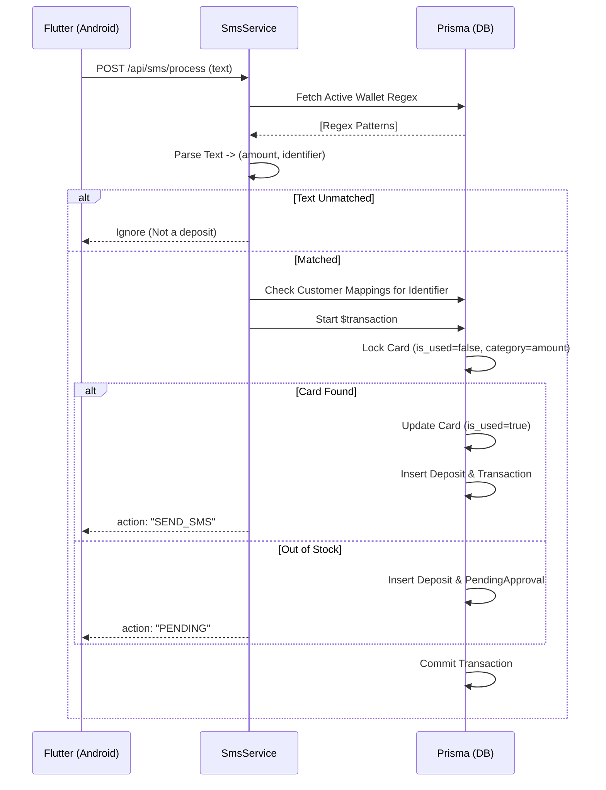

# Technical Specification: SMS Parsing & Distribution Engine (The Brain)

## 1. الهدف (Goal)
أتمتة العملية التجارية بالكامل. هذا المحرك هو القلب النابض للنظام؛ يستقبل رسائل الإيداع المالي من الموبايل ويتخذ قرار الصرف خلال أجزاء من الثانية بناءً على القيود والشروط المعدة مسبقاً.

## 2. المسؤوليات (Responsibilities)
- قراءة وتصفية النص الوارد (Raw SMS).
- مطابقة النص مع القوالب الديناميكية للمحافظ (`WalletConfigs`).
- استخراج (المبلغ، ورقم العميل أو حسابه).
- معالجة الأرقام المرتبطة بحسابات وهمية (Customer Mappings).
- صرف كرت من المخزون، أو تحويل العملية لمعلقة (Pending).

## 3. الملفات المتضمنة (Files)
- `sms.controller.ts`
- `sms.service.ts`
- `regex-parser.util.ts`
- `SmsReceiver.kt` (Android Native Component)

## 4. Classes المطلوبة
- `SmsService`: يدير الدورة كاملة.
- `RegexParser`: كلاس مساعد (Helper) لتنفيذ المطابقة.
- `DistributionEngine`: كلاس يفصل عملية سحب الكرت وحجز المعاملة.

## 5. Interfaces
- `IParsedSmsResult { amount: number; identifier: string; walletName: string; isAccount: boolean }`

## 6. Business & Validation Rules (قواعد العمل)
- **قاعدة الأمان (Idempotency):** يُمنع صرف كرتين لنفس الإيداع. يجب التحقق إذا كانت رسالة SMS بنظام طابع زمني ورقم هاتف قد تم تسجيلها مسبقاً خلال آخر 5 دقائق.
- **قاعدة المطابقة:** إذا لم يتطابق النص مع أي محفظة مفعلة، ترفض الرسالة ولا تُخزن كـ Deposit.
- **قاعدة الأولوية:** الحسابات (Account Codes) المربوطة في `CustomerMappings` لها أولوية. إذا تطابق معرّف مع الجدول، يتم الإرسال لرقم الجوال المربوط به.

## 7. Database Tables
- `wallet_configs` (لجلب قواعد Regex النشطة).
- `customer_mappings` (لتحويل الكود إلى رقم جوال).
- `cards` (للسحب والتحديث).
- `deposits` & `transactions` & `pending_approvals` (للأرشفة).

## 8. Sequence Diagram

## 9. حالات الخطأ والمعالجة (Error Handling)
- `RACE_CONDITION`: منع السحب المتزامن باستخدام Transaction Locks في Prisma.
- `REGEX_TIMEOUT`: تعبير نمطي سيء يسبب بطء. يجب وضع حد أقصى للتحليل.

## 10. Unit Tests & Integration Tests
- **Unit Test:** تزويد `RegexParser` بـ 50 صيغة مختلفة من محافظ يمنية والتأكد من استخراج المبلغ والرقم بدقة 100%.
- **Integration Test:** محاكاة 50 طلب استلام SMS متزامن (Concurrent requests) لنفس فئة الكرت 100 ريال والتأكد من أن قاعدة البيانات لن تصرف كروتاً أكثر من المتوفر (اختبار الـ Deadlocks والـ Race Conditions).

## 11. Acceptance Criteria & DoD
- **المعيار:** النظام لا يخطئ في تحديد المبلغ مهما احتوت الرسالة من أرقام إضافية.
- **الإنهاء:** الكود موثق، الاختبارات مجتازة بنسبة 100%، وتم دمج الكود في `main`.
